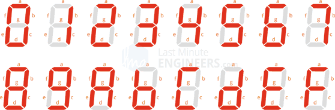
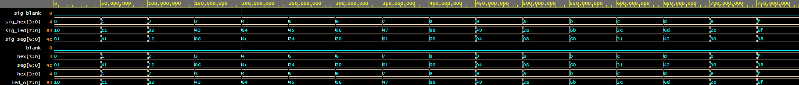

# Lab 4: MILAN BUDAY

### Pre-Lab preparation

	Complete the decoder truth table for **common anode** 7-segment display.

   | **Symbol** | **Inputs** | **a** | **b** | **c** | **d** | **e** | **f** | **g** |
   | :-: | :-: | :-: | :-: | :-: | :-: | :-: | :-: | :-: |
   | 0 | 0000 | 0 | 0 | 0 | 0 | 0 | 0 | 1 |
   | 1 | 0001 | 1 | 0 | 0 | 1 | 1 | 1 | 1 |
   | 2 | 0010 | 0 | 0 | 1 | 0 | 0 | 1 | 0 |
   | 3 | 0011 | 0 | 0 | 0 | 0 | 1 | 1 | 0 |
   | 4 | 0100 | 1 | 0 | 0 | 1 | 1 | 0 | 0 |
   | 5 | 0101 | 0 | 1 | 0 | 0 | 1 | 0 | 0 |
   | 6 | 0110 | 0 | 1 | 0 | 0 | 0 | 0 | 0 |
   | 7 | 0111 | 0 | 0 | 0 | 1 | 1 | 1 | 1 |
   | 8 | 1000 | 0 | 0 | 0 | 0 | 0 | 0 | 0 |
   | 9 | 1001 | 0 | 0 | 0 | 0 | 1 | 0 | 0 |
   | A | 1010 | 0 | 0 | 0 | 1 | 0 | 0 | 0 |
   | b | 1011 | 0 | 0 | 1 | 1 | 1 | 1 | 1 |
   | C | 1100 | 0 | 1 | 1 | 0 | 0 | 0 | 1 |
   | d | 1101 | 1 | 0 | 0 | 0 | 0 | 1 | 0 |
   | E | 1110 | 0 | 1 | 1 | 0 | 0 | 0 | 0 |
   | F | 1111 | 0 | 1 | 1 | 1 | 0 | 0 | 0 |

   > 
   >
   > The image above was used from website: [How Seven Segment Display Works & Interface it with Arduino](https://lastminuteengineers.com/seven-segment-arduino-tutorial/).
   >

<a name="part1"></a>

### LED(7:4) indicators

1. Complete the truth table for LEDs(7:4) according to comments in source code.

   | **Hex** | **Inputs** | **LED4** | **LED5** | **LED6** | **LED7** |
   | :-: | :-: | :-: | :-: | :-: | :-: |
   | 0 | 0000 | 1 | 0 | 0 | 0 |
   | 1 | 0001 | 0 | 0 | 1 | 1 |
   | 2 | 0010 | 0 | 0 | 0 | 1 |
   | 3 | 0011 | 0 | 0 | 1 | 0 |
   | 4 | 0100 | 0 | 0 | 0 | 1 |
   | 5 | 0101 | 0 | 0 | 1 | 0 |
   | 6 | 0110 | 0 | 0 | 0 | 0 |
   | 7 | 0111 | 0 | 0 | 1 | 0 |
   | 8 | 1000 | 0 | 0 | 0 | 1 |
   | 9 | 1001 | 0 | 0 | 1 | 0 |
   | A | 1010 | 0 | 1 | 0 | 0 |
   | b | 1011 | 0 | 1 | 1 | 0 |
   | C | 1100 | 0 | 1 | 0 | 0 |
   | d | 1101 | 0 | 1 | 1 | 0 |
   | E | 1110 | 0 | 1 | 0 | 0 |
   | F | 1111 | 0 | 1 | 1 | 0 |

2. Listing of LEDs(7:4) of VHDL architecture `hex_led`. Try to write logic functions as simple as possible. Always use syntax highlighting, meaningful comments, and follow VHDL guidelines:

>*For this part of assigment I used [EDA Playground](https://www.edaplayground.com/x/kK5R) where I created new entity 'hex_led' and testbench the LED indicators.

   ```vhdl
   --------------------------------------------------------------------
   -- Experiments on your own: LED(7:4) indicators

   -- Turn LED(4) on if input value is equal to 0, ie "0000"
   if (hex = "0000") then
        led_o(4) <= '1';
        else
        led_o(4) <= '0';
   end if;

   -- Turn LED(5) on if input value is greater than "1001", ie 10, 11, 12, ...
   if (hex > "1001") then
        led_o(5) <= '1';
        else
        led_o(5) <= '0';
   end if;

   -- Turn LED(6) on if input value is odd, ie 1, 3, 5, ...
   led_o(6) <= hex(0);

   -- Turn LED(7) on if input value is a power of two, ie 1, 2, 4, or 8
   case hex is
        when "0001" =>
           led_o(7) <= '1';
        when "0010" =>
           led_o(7) <= '1';
        when "0100" =>
           led_o(7) <= '1';
        when "1000" =>
           led_o(7) <= '1';
        when others =>
           led_o(7) <= '0';
   		end case;
   ```

3. Screenshot with simulated time waveforms for LED(7:4). Always display all inputs and outputs (display the inputs at the top of the image, the outputs below them) at the appropriate time scale!

   